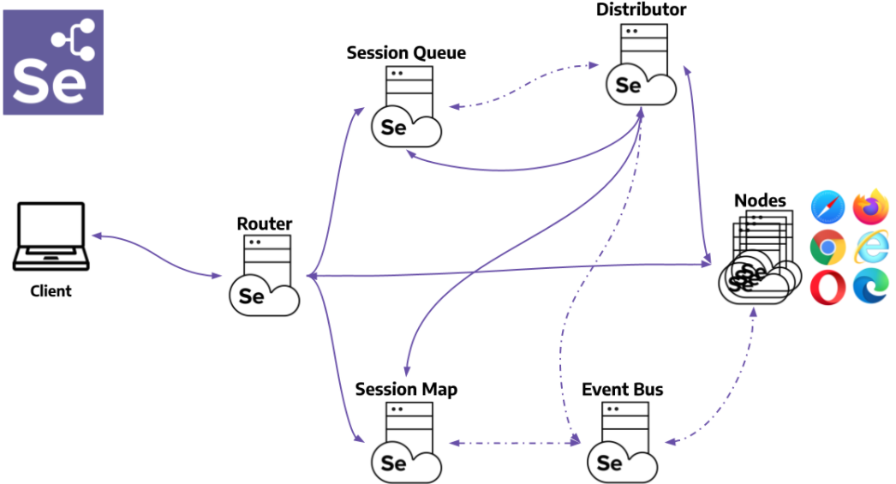
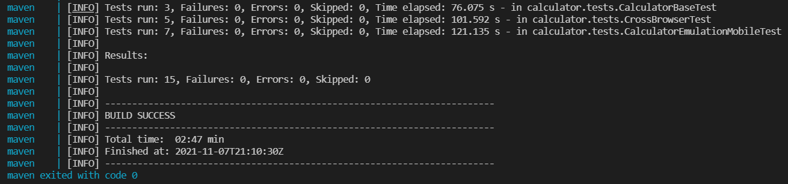
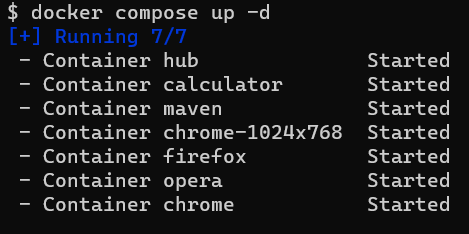

- [Visão geral do projeto](#visão-geral-do-projeto)
- [Pré-requisitos do sistema](#pré-requisitos-do-sistema)
- [Selenium Grid](#selenium-grid)
- [Solução proposta](#solução-proposta)
- [Execução do projeto](#execução-do-projeto)
- [Detalhando o arquivo docker-compose](#detalhando-o-arquivo-docker-compose)
- [Detalhando o projeto de testes](#detalhando-o-projeto-de-testes)
- [Acompanhando a execução com uso do VNC](#acompanhando-a-execução-com-uso-do-vnc)
- [Referências](#referências)


# Visão geral do projeto

Este projeto possui um exemplo de uso do selenium grid para execução de testes funcionais automatizados a partir de containers do docker com o intuito de auxiliar no aprendizado do selenium grid e do docker-compose.

Há exemplos de execução de testes em paralelo nos navegadores chrome, firefox e opera com uso do [Testng](https://testng.org/doc/documentation-main.html).

Simulação da execução em dispositivos móveis com a execução feita a partir do chrome.

Uso do docker compose para:
  * Construção da arquitetura HUB/NODES do selenium grid. 
  * Disponibilização de uma calculadora feita em [react](https://pt-br.reactjs.org/) que será o sistema sob testes.
  * Execução dos testes via linha de comando a partir de uma imagem do maven.
  * Execução de comandos e configurações básicas do docker-compose.

Exemplo de criação/configuração dos drivers com uso dos padrões de projeto Factory e Builder. 

Exemplo de externalização de variáveis em arquivo para configuração da execução remota via selenium grid ou local via Eclipse IDE. 

O objetivo deste projeto é ajudar no aprendizado da execução de testes com uso do selenium-grid e do docker-compose. Então foi usado um código de exemplo calculadora feito em react para servir como a aplicação sob testes. O projeto desta aplicação não será detalhado. Mas, nas referências, há o link para o [repositório original da aplicação](https://github.com/ahfarmer/calculator) e do fork que a imagem da aplicação foi criada. Você pode aproveitar, como forma de fixação do aprendizado, alterar o código para usar uma outra aplicação e usar os testes feitas para ela.

# Pré-requisitos do sistema

 - [Docker](https://docs.docker.com/get-docker/) e [Docker Compose](https://docs.docker.com/compose/compose-file/).
 - [GIT](https://git-scm.com/downloads)
 - Opcional. Caso queiram executar localmente o projeto.
   - [JDK 8 or later](https://www.oracle.com/java/technologies/downloads/).
   - [Eclipse](https://www.eclipse.org/downloads/) ou uma IDE de sua escolha.
   - Virtual Network Computing ([VNC](https://en.wikipedia.org/wiki/Virtual_Network_Computing)) para acompanhamento da execução via selenium grid.


# Selenium Grid

Selenium Grid permite a execução de scripts WebDriver em máquinas remotas (virtuais ou reais) por meio de comandos de roteamento enviados pelo cliente para instâncias remotas do navegador. Seu objetivo é fornecer uma maneira fácil de executar testes em paralelo em várias máquinas. [[5]](https://www.selenium.dev/documentation/grid/)

Neste exemplo, optamos por usar a solução de [hub/nodes](https://www.selenium.dev/pt-br/documentation/legacy/grid_3/components_of_a_grid/) do selenium grid onde o HUB centraliza todas as requisições realizadas e distribui entre os nós (local onde os testes de fato serão executados). Conforme a figura abaixo:
  

Esta arquitetura acima é adequada para poucos ou um número médios de nós.
Para uma solução mais complexa, o selenium grid fornece uma arquitetura completa de roteamento, distribuição de mensagens e gerenciamento de filas e sessões mais sofisticada que pode ser vista na [documentação oficial](https://www.selenium.dev/pt-br/documentation/grid/components_of_a_grid/) para mais detalhes.

  

  No nosso exemplo o [HUB](https://www.selenium.dev/documentation/_print/#hub-and-nodes) faz a função dos componentes:  Router, Distributor, Session Map, New Session Queue e Event Bus. 

# Solução proposta

Além do HUB, serão criados 4 nós para representar as seguintes máquinas:
  1. Máquina com o Chrome
  2. Outra com o Chrome, mas com uma resolução de tela customizada.
  3. Com o  Firefox
  4. E um nó para representação uma com o broser Opera.

A figura abaixo representa a solução dentro do docker com os container  do selenium grid, o container com a aplicação sob teste, no caso a calculadora. E um container maven que ficará responsável pela execução dos testes. Na figura também, do lado direito, tem a representação das imagens que foram usadas como base para criação destes containers.


O arquivo [docker-compose.yml](/docker-compose.yml) possui toda a especificação para criação e execução dos containter mostrados acima.

# Execução do projeto

Faça o clone do projeto em [https://github.com/raimundogomes18/example-selenium-grid](https://github.com/raimundogomes18/example-selenium-grid).

Abra um prompt de comando (todos os comandos listados neste projeto foram feitos usando git bash) 

Na pasta raiz do projeto, basta executar o comando: 
```
docker-compose up
```

No log devem aparecer as mensagens mostrando a criação dos containers e da rede `selenium_grid`, conforme a figura abaixo:


Em seguida aparecerá os detalhes da criação e configuração dos containers.

Deve aparecer a mensagem informando o local onde o hub espera que os nós se registrem e as mensagens destes nós se registrando no hub para estabelecer a comunicação entre eles.


Os nós tentam se registrar ao HUB a medida que são iniciados. As tentativas ocorrem por padrão a cada 5000ms.


Os IPs que aparecem no log são acessíveis somente de dentro do docker e os endereços dentro da rede selenium_grid. Para visualizarmos, fora do docker, devemos usar o endereço http://localhost:[porta]. Os números de todas as portas expostas foram externalizadas no arquivo [.env](./.env). 

Na tabela abaixo tem o mapeamento das portas:
|         Container           |             Endereço                   |  
| -------------------    | ------------------------------------- |  
| chome  |    http://localhost:5551/wd/hub       |  
| chome-1024x768  |    http://localhost:5552/wd/hub       | 
| firefox |    http://localhost:5553/wd/hub   |
| opera |    http://localhost:5554/wd/hub   |
| hub |    http://localhost:4444/   |
| calculator |    http://localhost:3000/   |

Apenas como curiosidade:
 * O comando abaixo pode ser usado para visualizar os IPs do hub, dos nós e da aplicação calculadora dentro do docker:

   ```
   docker inspect -f '{{.Name}} IP: {{range .NetworkSettings.Networks}}{{.IPAddress}}{{end}}' chrome chrome-1024x768 firefox opera calculator
   ```
   

 * Para visualizar o mapeamento de uma porta especifica, o comando abaixo pode ser usado:
   ```
   docker container port CONTAINER [PRIVATE_PORT]
   ```
 * Por exemplo, para visualizar qual porta seria a equivalente a 5555 para o container chrome o comando seria:
   ```
   docker container port chrome 5555
   ```

**GRID CONSOLE**

Para verificar todos os nós criados, acesse o grid-console no endereço:
[http://localhost:4444/grid/console](http://localhost:4444/grid/console). 


As sessões ativas dos nós podem ser vistas acessando diretamente o nó, conforme exemplo abaixo: 


**APLICAÇÃO** 

Acesse o endereço http://localhost:3000 para acessar a aplicação da calculadora:


Retomando as mensagens do log. Também deve constar as mensagens de sucesso da criação do container da aplicação e da execução dos testes com sucesso.


**Resultado dos testes**

Existem 14 testes no projeto de testes. Se tudo estiver ocorrido bem, a mensagem de BUILD SUCESSS deve aparecer no log, parecido com a figura abaixo:



O container do maven tem a finalidade de executar os testes. Em seguida ele para automaticamente. Ao contrário da aplicação e dos containers do selenium grid que ficarão executando até o comando para pará-los seja executado. 

Você pode visualizar os container criados com o docker compose:
 1. Pelo dashboard do Docker, caso tenha o docker Desktop instalado.
      
 2. Ou por outra IDE como o [VSCODE](https://code.visualstudio.com/), por exemplo.
      
 3. Ou com o comando `docker ps` para visualizar os container ativos.
 4. Como o container do maven não estará mais ativo , pode usar o comando ` docker ps -a | grep maven` para visualizá-lo.

**Parando os containers**

Para parar os containers, você deve apertar as teclas CTRL C ao mesmo tempo.

Execute o comando docker-compose down para remover todos os container criados, além da rede selenium_grid.
```
docker-compose down
```


Você pode optar por criar os containers de forma detachado, assim será exibido apenas as mensagens que os containers foram iniciados, mas o prompt de comando não ficará travado. Nem mostrará os detalhes da inicialização.
```
docker-compose up -d
```


Então você pode também optar por apenas parar(`docker-compose stop`) os container e depois iniciá-los(`docker-compose start`) novamente. Sem ter que ficar criando e destruindo-os sempre.


# Detalhando o arquivo docker-compose
 PENDENTE
# Detalhando o projeto de testes
PENDENTE

# Acompanhando a execução com uso do VNC

O VNC (Virtual Network Computing) é um protocolo de internet que permite a visualização de interfaces gráficas remotas através de uma conexão segura. Em outras plavras, você pode acessar  o conteúdo de outro computador remotamente, através da internet.

Para acompanhar a execução dos testes que está ocorrendo de dentro dos nós do selenium grid, você pode usar uma IDE de sua preferência. 

No exemplo abaixo está sendo usado o [VNC Viewer](https://www.realvnc.com/pt/connect/download/viewer/).

A figura mostra dois containers do chrome, um sendo exibido pela porta 5901 e outro na porta 5902. No momento captura da imagem dois testes da calculadora estavam sendo executados em paralelo.


# Referências

  1. [Docker](https://docs.docker.com/get-docker/)
  2. [Docker Compose](https://docs.docker.com/compose/)
  3. [docker-compose file](https://docs.docker.com/compose/compose-file/)
  4. [Docker maven image](https://hub.docker.com/_/maven)
  5. [Docker selenium](https://github.com/SeleniumHQ/docker-selenium)
  6.  [Dockerfile selenium/node-chrome-debug](https://hub.docker.com/r/selenium/node-chrome-debug/dockerfile)
  7. [Selenium grid](https://www.selenium.dev/documentation/grid/)
  8. [Componentes do grid 3](https://www.selenium.dev/pt-br/documentation/legacy/grid_3/components_of_a_grid/)
  9. [Download JDK](https://www.oracle.com/java/technologies/downloads/)
  10. [Download VNC](https://www.realvnc.com/pt/connect/download/viewer/)
  11. [Testng](https://testng.org/doc/documentation-main.html)
  12. [how-to-execute-testng-tests-with-maven-build](https://howtodoinjava.com/testng/how-to-execute-testng-tests-with-maven-build/)
  13. [Repositório original do proejto calculator](https://github.com/ahfarmer/calculator)
  14. [Repositório fork do projeto calculator](https://github.com/raimundogomes18/calculator)
  15. [Example calculator image](https://hub.docker.com/repository/docker/raimundogomes18/example_calculator)
  16. [mobile-emulation](https://chromedriver.chromium.org/mobile-emulation)
  17. [devtools/device-mode](https://developer.chrome.com/docs/devtools/device-mode/)
  18. [React](https://pt-br.reactjs.org/)
  19. [Declare default environment variables in file](https://docs.docker.com/compose/env-file/)