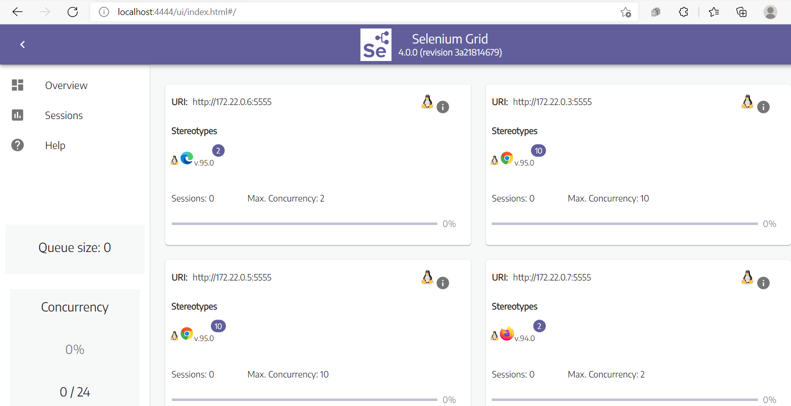

- [Visão geral do projeto](#visão-geral-do-projeto)
- [Pré-requisitos do sistema](#pré-requisitos-do-sistema)
- [Selenium Grid](#selenium-grid)
- [Solução proposta com arquitetura hub/nós](#solução-proposta-com-arquitetura-hubnós)
- [Execução do projeto](#execução-do-projeto)
    - [Disponilizando a aplicação](#disponilizando-a-aplicação)
    - [Disponilizando os serviços do selenium grid](#disponilizando-os-serviços-do-selenium-grid)
    - [Execcutando os testes da aplicação](#execcutando-os-testes-da-aplicação)
    - [Acompanhando a execução com uso do VNC](#acompanhando-a-execução-com-uso-do-vnc)
    - [parando e removendo os container criados](#parando-e-removendo-os-container-criados)
- [Detalhando o arquivo docker-compose](#detalhando-o-arquivo-docker-compose)
- [Detalhando o projeto de testes](#detalhando-o-projeto-de-testes)
- [Referências](#referências)


# Visão geral do projeto

Este projeto possui um exemplo de uso do selenium grid para execução de testes funcionais automatizados a partir de containers do docker com o intuito de auxiliar no aprendizado do selenium grid e do docker-compose.

Uso do <b><i>[docker-compose](https://docs.docker.com/compose/)</i></b> para:
  * Construção das arquiteturas HUB/NODES e FULL GRID do selenium grid. 
  * Disponibilização de uma calculadora feita em [react](https://pt-br.reactjs.org/) que será o sistema sob testes.
  * Execução dos testes via linha de comando a partir de uma imagem do [maven](https://maven.apache.org/).
  * Execução de comandos e configurações do docker-compose como, por exemplo:
    * Uso de <i>profiles</i>.
    * Reuso de arquivos com uso de <i>extends</i>.
    * Visualização de logs
    * Externalização de variáveis.

O Projeto contendo os testes da aplicação foram feitos em Java, com uso de [selenium](https://www.selenium.dev/) e  [Junit 5](https://junit.org/junit5/docs/current/user-guide/) para automação dos testes funcionais. Nele contém:

* Exemplos de [testes <i>cross browser</i>](https://developer.mozilla.org/en-US/docs/Learn/Tools_and_testing/Cross_browser_testing/Introduction) nos navegadores chrome, firefox e edge.
* Exemplos de testes com simulação de uso de dispositivos móveis.
* Exemplos de criação/configuração dos drivers com uso dos padrões de projeto Factory e Builder. 
* Exemplo de externalização de variáveis em arquivo para configuração da execução remota via selenium grid ou local via Eclipse IDE ou outra IDE de preferência. 
* Uso de [multiplos módulos do maven](https://maven.apache.org/guides/mini/guide-multiple-modules.html) para criação do projeto de testes.
* Uso do plugin <i>[maven-surefire-plugin](https://maven.apache.org/surefire/maven-surefire-plugin/)</i> para execução dos testes via linha de comando.

Foi usado um código de exemplo de uma calculadora feita em react para servir como a aplicação sob testes. O projeto desta aplicação não será detalhado. Mas, nas referências, há o link para o [repositório original da aplicação](https://github.com/ahfarmer/calculator) e da imagem que consta no [docker hub](https://hub.docker.com/repository/docker/raimundogomes18/example_calculator). Você pode aproveitar, como forma de fixação do aprendizado, alterar o código para usar uma outra aplicação e usar os testes feitos para ela.

# Pré-requisitos do sistema

Você deve ter um ambiente com [git]((https://git-scm.com/downloads)), [java](https://www.oracle.com/java/technologies/downloads/), [maven](https://maven.apache.org/), [docker]((https://docs.docker.com/get-docker/)) e [docker compose](https://docs.docker.com/compose/install/) instalados e configurados. Além disso, alguma IDE de sua preferência como, por exemplo, [Eclipse](https://www.eclipse.org/downloads/) ou [VSCODE](https://code.visualstudio.com/).

Opcional  - Uma <i>Virtual Network Computing</i> ([VNC](https://en.wikipedia.org/wiki/Virtual_Network_Computing)) para acompanhamento da execução dos testes. A IDE [VNC Viewer](https://www.realvnc.com/pt/connect/download/viewer/) é um exemplo de IDE que pode ser usada para isso. 


# Selenium Grid

Selenium Grid permite a execução de scripts WebDriver em máquinas remotas (virtuais ou reais) por meio de comandos de roteamento enviados pelo cliente para instâncias remotas do navegador. Seu objetivo é fornecer uma maneira fácil de executar testes em paralelo em várias máquinas. [[5]](https://www.selenium.dev/documentation/grid/)

Então se você deseja executar [testes <i>cross browser</i>](https://developer.mozilla.org/en-US/docs/Learn/Tools_and_testing/Cross_browser_testing/Introduction) e/ou testar [responsividade](https://growhackscale.com/glossary/mobile-responsiveness) em diferentes dispositivos móveis em paralelo com vários navegadores a partir de um ponto central de forma escalável e distribuída, facilitando a execução dos testes, então Selenium Grid é um exemplo de ferramenta que pode auxliá-lo nesta tarefa.

Com o selenium grid você pode optar por usar uma solução de [hub/nodes](https://www.selenium.dev/pt-br/documentation/legacy/grid_3/components_of_a_grid/) do selenium grid onde um HUB centraliza todas as requisições realizadas e distribui entre os nós (local onde os testes de fato serão executados). Conforme a figura abaixo:
  

Esta arquitetura acima é adequada para poucos ou um número médios de nós.
Para uma solução mais complexa, o selenium grid fornece uma arquitetura completa de roteamento, distribuição de mensagens e gerenciamento de filas e sessões mais sofisticada que pode ser vista na [documentação oficial](https://www.selenium.dev/pt-br/documentation/grid/components_of_a_grid/) para mais detalhes.

  
  <center><small>Figura acima foi retirada da documentação e representa a arquitetura completa selenium do grid 4.</small></center>

 # Solução proposta com arquitetura hub/nós
Nesta arquitetura o [HUB](https://www.selenium.dev/documentation/_print/#hub-and-nodes) faz a função dos componentes:  Router, Distributor, Session Map, New Session Queue e Event Bus. 

Além do HUB, serão criados 4 nós para representar as seguintes máquinas:
  1. Máquina com o Chrome
  2. Outra com o Chrome, mas com uma resolução de tela customizada.
  3. Com o  Firefox
  4. E um nó com o navegador Edge.

A figura abaixo representa a solução dentro do docker com os container  do selenium grid, o container com a calculador(aplicação sob teste). E por fim um container maven que ficará responsável pela execução dos testes. Na figura, também, tem a representação das imagens que foram usadas como base para criação destes containers.


Abaixo segue uma visão abreviada da estrutura do projeto:


# Execução do projeto

Faça o clone do projeto em [https://github.com/raimundogomes18/example-selenium-grid](https://github.com/raimundogomes18/example-selenium-grid).

Abra um prompt de comando (todos os comandos listados neste projeto foram feitos usando git bash) 

### Disponilizando a aplicação
Vamos começar disponibilizando a calculadora. Na pasta raiz do projeto, basta executar o comando: 
```
docker-compose -f deploy-calculator.yml up -d
```

Se tudo ocorrer bem a imagem da calculadora será baixada e você visualizará no final a mensagem <i>Creating calculator ... done</i>.

Aguarde alguns segundos, e execute o comando  
```
docker-compose -f deploy-calculator.yml logs
```
Você deve visualizar a mensagem <i>Compiled successfully!</i>. conforme imagem a baixo:


Em seguida acesse o navegador de sua preferência e acesse:
[http://localhost:3000](http://localhost:3000) para visualizar a calculadora.


### Disponilizando os serviços do selenium grid

Agora vamos subir os serviços do selenium grid. Execute o comando:
```
docker-compose -f hub-node/docker-compose.yml up -d
```
Este comando, na primeira vez que executado demorará um pouco mais, por que baixará todas as imagens usadas no selenium grid.

No final do log, você deve visualizar umas mensagens semelhantes as abaixo:
```
Creating hub                        ... done
Creating hub-node_chrome_1          ... done
Creating hub-node_chrome-1024x768_1 ... done
Creating hub-node_edge_1            ... done
Creating hub-node_firefox_1         ... done
```
As mensagens acima indicam apenas que os containers foram criados, mas ainda levará mais alguns segundos ou minutos para a comunicação entre o hub e os nós sejam completamente estabelecidas.

Você pode acompanhar o log com o comando: `docker-compose -f hub-node/docker-compose.yml logs`.

No log deve aparecer, para cada nó, a mensagem <i>`Node has been added`</i>.

Caso deseje visualizar somente o log de um serviço especifico, basta executar o comando `docker-compose -f hub-node/docker-compose.yml logs [serviço]`. Como por exemplo: `docker-compose -f hub-node/docker-compose.yml logs hub` para visualizar somente o log do hub.

Em seguida acesse: [http://localhost:4444/](http://localhost:4444/) para visualizar o grid e os nós que foram criados.

Você deve visualizar uma imagem semelhante a abaixo:


### Execcutando os testes da aplicação

Para executar os testes, execute o comando:
```
GRID_URL_ADDRESS=hub GRID_URL_PORT=4444 NETWORK_NAME=selenium-grid docker-compose -f maven-test-calculator.yml up
```
O maven precisa saber o endereço e porta onde ele fará a execução remota. Para isso, antes do comando docker-compose foi passado os parâmetros  `GRID_URL_ADDRESS` e `GRID_URL_PORT`. O docker-compose entenderá estes parâmetros como variáveis de ambiente.

Ao final da execução o log deve exibir as mensagens: <i>`BUILD SUCCESS`</i> e <i>`maven exited with code 0`</i>, conforme imagem abaixo:


### Acompanhando a execução com uso do VNC

O VNC (Virtual Network Computing) é um protocolo de internet que permite a visualização de interfaces gráficas remotas através de uma conexão segura. Em outras palavras, você pode acessar  o conteúdo de outro computador remotamente, através da internet.

Para acompanhar a execução dos testes que está ocorrendo de dentro dos nós do selenium grid, você pode usar uma IDE de sua preferência. 

No exemplo abaixo está sendo usado o [VNC Viewer](https://www.realvnc.com/pt/connect/download/viewer/).

A figura abaixo mostra que no momento da captura da imagem, todos os nós do selenium grid estavam sendo usados pelos testes executados na calculadora.


O mapeamento das portas pode ser alterado no arquivo [hub-node/.env](/hub-node/.env).

Na tabela abaixo tem o mapeamento das portas para configuração no VNC:
|         Container      |   Porta    |  
| -------------------    | ---------- |  
| chome                  |   5901     |  
| chome-1024x768         |   5902     | 
| firefox                |   5903     |
| edge                   |   5904     |


Você pode executar novamente os testes repetindo o comando demonstrado mais acima ou apenas com o comando `docker start maven`. 

Pois o container do maven foi parado, mas ainda continua na listagem de containers.
Pode visualizá com o comando: 
```
docker ps -a --filter "name=maven"
```


Para visualizar o log, execute o comando: 
```
docker container logs  maven
```  

### parando e removendo os container criados

Primeiro vamos remover o container do maven com o comando `docker rm maven`.

Em seguida vamos parar os container do selenium-grid com o comando:
```
docker-compose -f hub-node/docker-compose.yml stop
```

As mensagens abaixo devem ser exibidas:
<pre>
Stopping hub-node_firefox_1         ... done
Stopping hub-node_edge_1            ... done
Stopping hub-node_chrome-1024x768_1 ... done
Stopping hub                        ... done
Stopping hub-node_chrome_1          ... done
</pre>

A calculadora com o comando:
```
docker-compose -f deploy-calculator.yml stop
```

As mensagens abaixo devem ser exibidas:
<pre>
Stopping calculator ...        ... done
</pre>

Para remover os containers do selenium grid em definitivo: `docker-compose  -f hub-node/docker-compose.yml  down`.

As mensagens abaixo devem ser exibidas:
<pre>
Removing hub-node_firefox_1         ... done
Removing hub-node_edge_1            ... done
Removing hub-node_chrome-1024x768_1 ... done
Removing hub                        ... done
Removing hub-node_chrome_1          ... done
Removing network selenium-grid      ... done
</pre>

Para remover o container da calculadora em definitivo: 

```
docker-compose  -f deploy-calculator.yml  down
```
As mensagens abaixo devem ser exibidas:
<pre>
Removing calculator ... done
Removing network selenium-grid
WARNING: Network selenium-grid not found.
</pre>

Observe que a rede `selenium-grid` foi removida junto com os containers do selenium grid, por isso o WARNING de `not found`.  

# Detalhando o arquivo docker-compose
 PENDENTE
# Detalhando o projeto de testes
PENDENTE

# Referências

  1. [Docker](https://docs.docker.com/get-docker/)
  2. [Docker Compose](https://docs.docker.com/compose/)
  3. [docker-compose file](https://docs.docker.com/compose/compose-file/)
  4. [Docker maven image](https://hub.docker.com/_/maven)
  5. [Docker selenium](https://github.com/SeleniumHQ/docker-selenium)
  7. [Selenium grid](https://www.selenium.dev/documentation/grid/)
  8. [Componentes do grid 3](https://www.selenium.dev/pt-br/documentation/legacy/grid_3/components_of_a_grid/)
  9. [Download JDK](https://www.oracle.com/java/technologies/downloads/)
  10. [Download VNC](https://www.realvnc.com/pt/connect/download/viewer/)
  11. [Repositório original do projeto calculator](https://github.com/ahfarmer/calculator)
  12. [Repositório fork do projeto calculator](https://github.com/raimundogomes18/calculator)
  13. [Example calculator image](https://hub.docker.com/repository/docker/raimundogomes18/example_calculator)
  14. [mobile-emulation](https://chromedriver.chromium.org/mobile-emulation)
  15. [devtools/device-mode](https://developer.chrome.com/docs/devtools/device-mode/)
  16. [React](https://pt-br.reactjs.org/)
  17. [Declare default environment variables in file](https://docs.docker.com/compose/env-file/)
  18. [Share Compose configurations between files and projects](https://docs.docker.com/compose/extends/)
  19. [Networking in Compose](https://docs.docker.com/compose/networking/)
  20. [docker-compose profiles](https://docs.docker.com/compose/profiles/)
  21. [maven](https://maven.apache.org/)
  22. [maven-surefire-plugin](https://maven.apache.org/surefire/maven-surefire-plugin/)
  23. [Junit 5](https://junit.org/junit5/docs/current/user-guide/)
