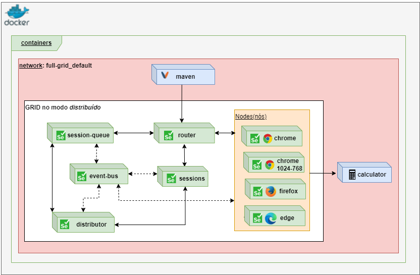

- [Visão geral do projeto](#visão-geral-do-projeto)
- [Pré-requisitos do sistema](#pré-requisitos-do-sistema)
- [Selenium Grid](#selenium-grid)
- [Docker Compose](#docker-compose)
- [Solução proposta com arquitetura hub/node](#solução-proposta-com-arquitetura-hubnode)
- [Solução com arquitetura completa do selenium grid](#solução-com-arquitetura-completa-do-selenium-grid)
- [Execução do projeto](#execução-do-projeto)
    - [Execução via Selenium GRID Standalone](#execução-via-selenium-grid-standalone)
    - [Execução via Selenium GRID nos modos distribuídos](#execução-via-selenium-grid-nos-modos-distribuídos)
    - [Acompanhando a execução com uso do VNC](#acompanhando-a-execução-com-uso-do-vnc)
- [Detalhando o arquivo docker-compose](#detalhando-o-arquivo-docker-compose)
- [Detalhando o projeto de testes](#detalhando-o-projeto-de-testes)
- [Referências](#referências)


# Visão geral do projeto

Este projeto possui exemplos de uso do selenium grid para execução de testes funcionais automatizados a partir de containers do docker com o intuito de auxiliar no aprendizado do selenium grid e do docker-compose.

Aborda:
  * Criação dos serviços do selenium grid nos modos STANDALONE, HUB/NODES e FULL GRID.
  * Execução dos testes via linha de comando a partir de uma imagem do [maven](https://maven.apache.org/).
  * Execução de comandos e configurações do docker-compose como por exemplo:
    * Uso de <i>profiles</i>.
    * Extender serviços com uso vários arquivos .yaml.
    * Externalização de variáveis.

O Projeto contendo os testes da aplicação foram feitos em Java, com uso de [selenium](https://www.selenium.dev/) e  [Junit 5](https://junit.org/junit5/docs/current/user-guide/) para automação dos testes funcionais. Nele contém:

* Exemplos de [testes <i>cross browser</i>](https://developer.mozilla.org/en-US/docs/Learn/Tools_and_testing/Cross_browser_testing/Introduction) nos navegadores chrome, firefox e edge.
* Exemplos de testes com simulação de uso de dispositivos móveis.
* Exemplos de criação/configuração dos drivers com uso dos padrões de projeto Factory e Builder. 
* Exemplo de externalização de variáveis em arquivo para configuração da execução remota via selenium grid ou local via Eclipse IDE ou outra IDE de preferência. 
* Uso de [multiplos módulos do maven](https://maven.apache.org/guides/mini/guide-multiple-modules.html) para criação do projeto de testes.
* Uso do plugin <i>[maven-surefire-plugin](https://maven.apache.org/surefire/maven-surefire-plugin/)</i> para execução dos testes via linha de comando.

Foi usado um código de exemplo de uma calculadora feita em react para servir como a aplicação sob testes. O projeto desta aplicação não será detalhado. Mas, nas referências, há o link para o [repositório original da aplicação](https://github.com/ahfarmer/calculator) e da imagem que consta no [docker hub](https://hub.docker.com/repository/docker/raimundogomes18/example_calculator). Você pode aproveitar, como forma de fixação do aprendizado, alterar o código para usar uma outra aplicação e usar os testes feitos para ela.

# Pré-requisitos do sistema

Você deve ter um ambiente com [git]((https://git-scm.com/downloads)), [java](https://www.oracle.com/java/technologies/downloads/), [maven](https://maven.apache.org/), [docker]((https://docs.docker.com/get-docker/)) e [docker compose](https://docs.docker.com/compose/install/) instalados e configurados. Além disso, alguma IDE de sua preferência como, por exemplo, [Eclipse](https://www.eclipse.org/downloads/) ou [VSCODE](https://code.visualstudio.com/).

Opcional  - Uma <i>Virtual Network Computing</i> ([VNC](https://en.wikipedia.org/wiki/Virtual_Network_Computing)) para acompanhamento da execução dos testes. A IDE [VNC Viewer](https://www.realvnc.com/pt/connect/download/viewer/) é um exemplo de IDE que pode ser usada para isso. 


# Selenium Grid

Selenium Grid permite a execução de scripts WebDriver em máquinas remotas (virtuais ou reais) por meio de comandos de roteamento enviados pelo cliente para instâncias remotas do navegador. Seu objetivo é fornecer uma maneira fácil de executar testes em paralelo em várias máquinas. [[5]](https://www.selenium.dev/documentation/grid/)

Então se você deseja executar [testes <i>cross browser</i>](https://developer.mozilla.org/en-US/docs/Learn/Tools_and_testing/Cross_browser_testing/Introduction) e/ou testar [responsividade](https://growhackscale.com/glossary/mobile-responsiveness) em diferentes dispositivos móveis em paralelo com vários navegadores a partir de um ponto central de forma escalável e distribuída, facilitando a execução dos testes, então Selenium Grid é um exemplo de ferramenta que pode auxliá-lo nesta tarefa.


 O selenium grid fornece a opção de execução em três modos:

**Modo standalone**, o selenium grid funciona como se todos os componentes estivessem juntos como um um único serviço. Então a mesma máquina/serviço que recebe as requisições, realiza a execução dos testes. É o modo mais simples. Usando o docker, será necessário apenas um container para iniciar o selenium grid.

**Modo hub/nodes**: O HUB centraliza todas as requisições realizadas e distribui entre os nodes(nós). Os nós é onde de fato os testes de serão executados. Neste modo o HUB faz a função dos componentes: Router, Distributor, Session Map, New Session Queue e Event Bus. Estes componentes serão detalhados mais abaixo.
  

**Modo fully distributed**(totalmente distribuído, em tradução livre) todos os componentes do selenium grid são usados. Será detalhado mais abaixo um pouco sobre este modo por ser o mais "complexo".

  
  <center><small>Figura acima foi retirada da documentação e representa a arquitetura completa selenium do grid 4.</small></center>

Os componentes do modo totalmente distribuído:

**Router (Roteador):** é o ponto de entrada do grid. Este componente é responsável por receber os eventos dos clientes e enviar para os nós onde estes eventos serão executados. Neste cenário, entenda evento como: um clique de um botão, preenchimento de um campo, por exemplo.
Session Queue (Fila de sessão): Contém uma fila com as novas sessões. Sempre que uma nova sessão chega no roteador, ele envia esta nova sessão para a fila de sessões.

**Session Map (Mapa de Sessão):** Contém um mapa (sessão/nó) de todas as sessões ativas e os respectivos nós responsáveis por estas sessões.

**Distributor (Distribuidor):** É responsável por ter o mapeamento de todos os nós e saber a quantidade de slots (sessões que podem ser criada) disponíveis em cada nó que pode receber uma nova requisição. Periodicamente o Distribuidor consulta a Fila de sessões e distribui para um nó que possa receber a nova sessão. logo em seguida adiciona a informação da sessão/nó no Mapa de sessões.

**Event Bus (Barramento de eventos):** É o componente responsável por auxiliar na comunicação entre os componentes Nós, Distribuidor, Fila de Sessão e Mapa de Sessões. As mensagens que podem ser recebidas de forma assíncrona entre os outros componentes são feitas pelo barramento de eventos.

**Node (Nó):** Neste componente é onde os testes de fato serão executados. Ele é responsável por gerenciar a quantidade de sessões que pode receber em paralelo. Quando um nó é criado, ele envia a informação com suas características para o distribuidor via barramento de eventos.

O fluxo da comunicação entre os componentes quando chega uma nova sessão de um cliente será parecido com o demostrado na figura abaixo:

   


O fluxo da comunicação entre os componentes quando o cliente envia uma requisição/comando para uma sessão que já existe será semelhante com o demostrado na figura abaixo:

   

# Docker Compose

 É uma ferramenta do docker que serve para definir e iniciar vários serviços em conjunto. 
 
 Esta definição é feita a partir de um arquivo descrito com a linguagem de marcação YAML. Neste arquivo você pode configurar como os serviços serão criados, qual a ordem de dependências entre eles, as variáveis de ambientes, os volumes que serão usados por cada serviço, ou até mesmo comandos que os serviços devem executar na inicialização.

O docker-compose fornece a possibilidade de apenas partes dos serviços serem iniciados com uso de profiles(perfis). Se você definir um perfil para um serviço, ele será criado/iniciado, somente se o perfil for passado por parâmetro no comando de criação/inicialização dos serviços. No nosso exemplo foram definidos dois perfis:
Perfil deploy-app adicionado no serviço calculadora
Perfil test-app adicionado nos serviços calculadora e maven


|  profile   | containers            |
| ---------  | ------------         | 
| deploy-app | calculadora          |
| test-app   | calculadora e maven  |


Então se executar o comando padrão para criação dos serviços `docker-compose up`, os serviços da calculadora e do maven não serão criados. Apenas os componentes do selenium grid. Para criá-los será necessário passar o parâmetro profile, conforme exemplo abaixo:
```
docker-compose --profile=test-app up
```
ou
```
COMPOSE_PROFILES=test-app docker-compose up
```

Você pode estender serviços a fim de reusar configurações comuns entre eles. Será dado um exemplo na criação de dois nós que usam a mesma imagem do chrome(selenium/node-chrome), o mesmo número máximo de sessões(SE_NODE_MAX_SESSIONS), mas um deles foi customizado para usar uma resolução de tela diferente do padrão.

Outra funcionalidade é a possibilidade de usar variáveis a partir de um arquivo externo ou a partir de variáveis de ambiente. Todas as portas e endereços serão adicionados em um arquivo .env como forma de exemplo.
 Apenas o endereço de onde os testes devem ser executados remotamente será passado como variável de ambiente(REMOTE_URL) para o serviço do maven.
Como uma forma de aprendizado do docker-compose, neste projeto de exemplo, todas estas funcionalidades mencionadas acima foram utilizadas.

 # Solução proposta com arquitetura hub/node

Nesta arquitetura o [HUB](https://www.selenium.dev/documentation/_print/#hub-and-nodes) faz a função dos componentes:  Router, Distributor, Session Map, New Session Queue e Event Bus. 

Além do HUB, serão criados 4 nós para representar as seguintes máquinas:
  1. Máquina com o Chrome
  2. Outra com o Chrome, mas com uma resolução de tela customizada.
  3. Com o  Firefox
  4. E um nó com o navegador Edge.

A figura abaixo representa a solução dentro do docker com os container  do selenium grid, o container com a calculador(aplicação sob teste). E por fim um container maven que ficará responsável pela execução dos testes. Na figura, também, tem a representação das imagens que foram usadas como base para criação destes containers.


# Solução com arquitetura completa do selenium grid

A solução com todos os componentes do selenium grid foi disponibizada no diretório [full-grid](/full-grid/).


Além de todos os componentes do selenium grid, a calculadora e o maven foram incorporados dentro do arquivo [full-grid/docker-compose.yml](full-grid/docker-compose.yml).

Abaixo uma representação gráfica do serviços contidos no arquivo.



# Execução do projeto

Abaixo segue uma visão abreviada da estrutura do projeto:


Faça o clone do projeto em [https://github.com/raimundogomes18/example-selenium-grid](https://github.com/raimundogomes18/example-selenium-grid).

Abra um prompt de comando (todos os comandos listados neste projeto foram feitos usando git bash) 

Em todos os examplos foi adicionado o uso de uma [volume externo](https://docs.docker.com/storage/volumes/#use-a-volume-with-docker-compose) para servir de cache das dependências do maven.
Então crie o volume  m2_repository com o comando abaixo:
```
 docker volume create m2_repository
```
### Execução via Selenium GRID Standalone

Acesse a pasta `standalone`.

Lista de comandos:
| Comando     | Descrição
| ------------                                 |--------------------------------------------
| `docker-compose up -d`                       | Inicia o serviço do selenium grid com o chrome
| `docker-compose --profile=deploy-app up -d`    | Inicia o serviço do selenium grid e a aplicação.
| `docker-compose --profile=test-app up -d`    | Inicia o serviço do selenium grid, a aplicação e a execução do serviço do maven que executará os testes.
| `docker-compose --profile=test-app logs maven`  | Visualiza apenas o log do serviço do maven. 
| `docker-compose --profile=test-app logs --follow maven`  | Visualiza o log do serviço do maven e continua mostrando o log até o ctrl + C ser acionado.
| ` docker-compose --profile=test-app down` | Destruir todos os serviço criados.

Para os navegadores edge, firefox e opera foi usado o conceito de [compartilhamento/reúso de serviço entre arquivos do docker-compose](https://docs.docker.com/compose/extends/). Então para cada navegador foi criado um arquivo e nele sobrescrito:
  * No serviço `browser` a imagem 
  * E no serviço `maven` a variável de ambiente DEFAULT_BROWSER.
  
Segue exemplo para o opera:
```
services:
  browser:
    image: selenium/standalone-opera:75.0
    
  maven:
    environment:
     DEFAULT_BROWSER: "opera"
```

Comando para execução com o navegador EDGE:
```
docker-compose -f docker-compose.yml -f docker-compose.edge.yml  --profile=test-app up -d
```

Destruir os serviços:
```
docker-compose -f docker-compose.yml -f docker-compose.edge.yml  --profile=test-app down
```
### Execução via Selenium GRID nos modos distribuídos
Para executar no modo hub/nó ou totalmente distribuído, basta a partir da pasta executar o comando:
`docker-compose --profile=test-app up -d`

### Acompanhando a execução com uso do VNC


O VNC (Virtual Network Computing) é um protocolo de internet que permite a visualização de interfaces gráficas remotas através de uma conexão segura. Em outras palavras, você pode acessar  o conteúdo de outro computador remotamente, através da internet.

Os exemplos do selenium grid standalone foram configurados para [acompanhamento na porta 7900 via navegador](https://github.com/SeleniumHQ/docker-selenium#using-your-browser-no-vnc-client-is-needed). Então para acompanhar, basta acessar http://locahost:7900


Para os exemplos nos modos hub/nó e distribuído, o acompanhamento foi configurado usando o [cilente vnc](https://github.com/SeleniumHQ/docker-selenium#using-a-vnc-client) que é disponibilizado na pora 5900.

No exemplo abaixo está sendo usado o [VNC Viewer](https://www.realvnc.com/pt/connect/download/viewer/).

A figura abaixo mostra que no momento da captura da imagem, todos os nós do selenium grid estavam sendo usados pelos testes executados na calculadora.


O mapeamento das portas pode ser alterado no arquivo [hub-node/.env](/hub-node/.env).

Na tabela abaixo tem o mapeamento das portas para configuração no VNC:
|         Container      |   Porta    |  
| -------------------    | ---------- |  
| chome                  |   5901     |  
| chome-1024x768         |   5902     | 
| firefox                |   5903     |
| edge                   |   5904     |


Você pode executar novamente os testes repetindo o comando demonstrado mais acima ou apenas com o comando `docker start maven`. 

Pois o container do maven foi parado, mas ainda continua na listagem de containers.
Pode visualizá com o comando: 
```
docker ps -a --filter "name=maven"
```


Para visualizar o log, execute o comando: 
```
docker container logs  maven
```


# Detalhando o arquivo docker-compose
 PENDENTE
# Detalhando o projeto de testes
PENDENTE


# Referências

  1. [Docker](https://docs.docker.com/get-docker/)
  2. [Docker Compose](https://docs.docker.com/compose/)
  3. [docker-compose file](https://docs.docker.com/compose/compose-file/)
  4. [Docker maven image](https://hub.docker.com/_/maven)
  5. [Docker selenium](https://github.com/SeleniumHQ/docker-selenium)
  7. [Selenium grid](https://www.selenium.dev/documentation/grid/)
  8. [Componentes do grid 3](https://www.selenium.dev/pt-br/documentation/legacy/grid_3/components_of_a_grid/)
  9. [Download JDK](https://www.oracle.com/java/technologies/downloads/)
  10. [Download VNC](https://www.realvnc.com/pt/connect/download/viewer/)
  11. [Repositório original do projeto calculator](https://github.com/ahfarmer/calculator)
  12. [Repositório fork do projeto calculator](https://github.com/raimundogomes18/calculator)
  13. [Example calculator image](https://hub.docker.com/repository/docker/raimundogomes18/example_calculator)
  14. [mobile-emulation](https://chromedriver.chromium.org/mobile-emulation)
  15. [devtools/device-mode](https://developer.chrome.com/docs/devtools/device-mode/)
  16. [React](https://pt-br.reactjs.org/)
  17. [Declare default environment variables in file](https://docs.docker.com/compose/env-file/)
  18. [Share Compose configurations between files and projects](https://docs.docker.com/compose/extends/)
  19. [Networking in Compose](https://docs.docker.com/compose/networking/)
  20. [docker-compose profiles](https://docs.docker.com/compose/profiles/)
  21. [maven](https://maven.apache.org/)
  22. [maven-surefire-plugin](https://maven.apache.org/surefire/maven-surefire-plugin/)
  23. [Junit 5](https://junit.org/junit5/docs/current/user-guide/)
  24. [variável de ambiente power shell](https://docs.microsoft.com/pt-br/powershell/module/microsoft.powershell.core/about/about_environment_variables?view=powershell-7.2)

